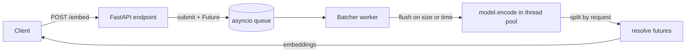

# inference_server

  [](https://beardedambivert-inference-server.hf.space)

Embedding inference server with FastAPI, ONNX Runtime support, and dynamic batching for latency-throughput tradeoff experiments.

**Live demo** — the server runs on Hugging Face Spaces:

```bash
curl -X POST https://beardedambivert-inference-server.hf.space/embed \
  -H "Content-Type: application/json" \
  -d '{"texts": ["hello world"]}'
```

Highlights:

- Dynamic batching with size and time based flush conditions.
- Async request handling with per-request futures mapped back after batched inference.
- Optional ONNX backend support through SentenceTransformers and ONNX Runtime.
- Docker configuration for CPU deployment and Hugging Face Spaces.
- Benchmark tooling for comparing sequential and concurrent request patterns.

## Why This Exists

Embedding workloads show up in semantic search, document similarity, recommendation systems, and retrieval-augmented generation pipelines. A naive inference API that runs one model call per HTTP request is simple, but it can leave throughput on the table when many small requests arrive concurrently.

This project explores a single-process serving design where requests enter an async API, wait briefly in an in-memory queue, and are grouped into larger model inference calls. The goal is to make the latency-throughput tradeoff explicit and measurable rather than treating batching as an implementation detail.

## Architecture



Request lifecycle:

1. A client sends `POST /embed` with one or more texts.
2. The FastAPI endpoint submits the request texts to `DynamicBatcher`.
3. `DynamicBatcher` stores the request with an `asyncio.Future` in an in-memory queue.
4. A background worker collects queued requests until the batch reaches the configured size limit or the wait window expires.
5. The worker flattens all request texts, runs one model inference call, splits embeddings back by request, and resolves each request future.
6. The endpoint returns the embeddings, embedding dimension, and number of input texts.

## Batching Strategy

Current defaults:

| Setting | Default | Meaning |
| --- | ---: | --- |
| `max_batch_size` | `32` | Maximum number of queued requests collected before inference runs. |
| `max_wait_ms` | `500` | Maximum wait time, in milliseconds, after the first queued request before flushing a partial batch. |

Flush conditions:

- Size trigger: run inference when the batch reaches `max_batch_size`.
- Time trigger: run inference when `max_wait_ms` elapses before the batch fills.

Tradeoff:

- Under low traffic, requests should flush after the wait window instead of waiting for a full batch.
- Under burst traffic, requests can be grouped into fewer model calls.
- Larger wait windows may improve batching opportunities but add latency for early requests in the batch.

## Benchmarks

Measured on Apple Silicon (macOS, arm64) with `all-MiniLM-L6-v2`, 500 requests at concurrency 32, one short sentence per request.


- **Batching is the win:** at a fixed concurrency of 32, raising the batch size from 1 to 32 roughly **halves p50 latency** and lifts throughput **~45–55%**.
- **Serving overhead is ~1.4 ms/request** over the raw `model.encode` floor.
- **MPS and ONNX are not faster here** — for this tiny model and tiny inputs the workload is overhead-bound, so the Apple GPU matches CPU and ONNX-CPU ties PyTorch-CPU. (Wins would need INT8 quantization and/or larger inputs.)

PyTorch on CPU, concurrency 32:

| Max batch size | p50 latency | Throughput |
| ---: | ---: | ---: |
| 1 (no batching) | 199.5 ms | 159.6 req/s |
| 32 | 103.7 ms | 231.1 req/s |

Full 16-run matrix and per-config numbers: [`benchmarks/README.md`](benchmarks/README.md). Why the numbers look this way, plus the fair-comparison methodology: [`benchmarks/ANALYSIS.md`](benchmarks/ANALYSIS.md).

Regenerate everything with one command (starts/stops a server per config):

```bash
uv run python scripts/run_matrix.py
```

## Design Decisions

- FastAPI keeps the HTTP layer small and async-friendly.
- `DynamicBatcher` separates request collection from endpoint handling, which makes the queueing and response-mapping behavior easier to reason about.
- Blocking model inference runs through `run_in_executor` so the event loop can continue accepting requests while inference is executing.
- PyTorch/SentenceTransformers remains the default backend so the server can start from a fresh clone without exported model artifacts.
- ONNX Runtime support is included as an opt-in backend, but performance claims should be based on measured benchmarks for the target hardware and configuration.
- The API returns the embedding dimension from the loaded model instead of hardcoding a model-specific value.

## Failure Handling & Limitations

Current behavior:

- Model inference errors are propagated to every request future in the failed batch.
- Shutdown cancels the worker task and marks queued requests with cancellation errors.
- `/health` reports service status, configured model name, and device.

Current limitations:

- The request queue is in-memory and unbounded.
- There is no explicit request timeout policy at the API layer.
- There is no queue overflow or backpressure strategy yet.
- The worker model is single-process and single-batcher.
- Persistent metrics are not exposed yet.
- ONNX mode requires an exported ONNX model directory under `models/minilm-onnx`.

## Future Improvements

- Add bounded queue capacity with explicit rejection or timeout behavior.
- Expose metrics for request rate, latency distribution, batch size distribution, and model errors.
- Add tests for batching, request-to-response mapping, failure propagation, and shutdown behavior.
- Clarify multi-worker deployment behavior and scaling limits.
- Add optional caching for repeated texts or use-case-specific workloads.

## Run Locally

Install dependencies:

```bash
uv sync
```

Start the server:

```bash
uv run uvicorn app.main:app --host 0.0.0.0 --port 8000
```

Export the ONNX model and run with the ONNX backend:

```bash
uv run python scripts/export_onnx.py
BACKEND=onnx uv run uvicorn app.main:app --host 0.0.0.0 --port 8000
```

Check health:

```bash
curl http://localhost:8000/health
```

Generate embeddings:

```bash
curl -X POST http://localhost:8000/embed \
  -H "Content-Type: application/json" \
  -d '{"texts": ["hello world"]}'
```

## Docker

Build the image:

```bash
docker build -t inference-server .
```

Run the container:

```bash
docker run -p 7860:7860 inference-server
```

Call the API:

```bash
curl -X POST http://localhost:7860/embed \
  -H "Content-Type: application/json" \
  -d '{"texts": ["hello world"]}'
```

## API

### `GET /health`

Returns service status and basic model configuration.

Example response:

```json
{
  "status": "ok",
  "model": "sentence-transformers/all-MiniLM-L6-v2",
  "device": "cpu"
}
```

### `POST /embed`

Request body:

```json
{
  "texts": ["hello world"]
}
```

Example response, with the embedding shortened for readability:

```json
{
  "embeddings": [[0.01, 0.02, 0.03]],
  "dim": 384,
  "num_texts": 1
}
```

The `embeddings` array contains one embedding vector per input text.
