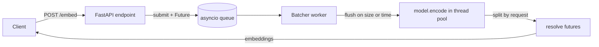
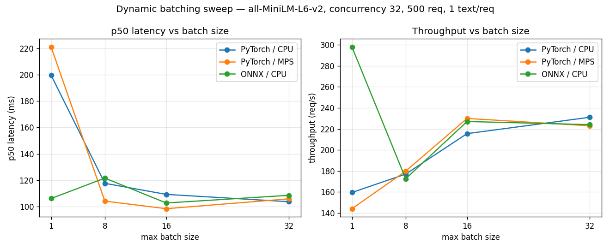

# inference_server

[](https://github.com/BeardedAmbivert/inference_server/actions/workflows/ci.yml)   [](https://beardedambivert-inference-server.hf.space)

Embedding inference server with FastAPI, optional ONNX Runtime (fp32 and dynamic INT8), and dynamic batching for latency-throughput tradeoff experiments.

**Live demo** on Hugging Face Spaces (CPU Docker image; first request after sleep may be slow). `/` is a landing page that lists the endpoints; Swagger is at `/docs`.

```bash
curl -X POST https://beardedambivert-inference-server.hf.space/embed \
  -H "Content-Type: application/json" \
  -d '{"texts": ["hello world"]}'
```

Highlights:

- Dynamic batching with size and time based flush conditions.
- Async request handling with per-request futures mapped back after batched inference.
- Optional ONNX backend: O3-optimized fp32 by default, or dynamic INT8 via `ONNX_FILE_NAME`.
- Encode batch equals `MAX_BATCH_SIZE` (not SentenceTransformers' hidden default of 32).
- Docker configuration for CPU deployment and Hugging Face Spaces.
- Benchmark tooling for synthetic and BeIR/nfcorpus workloads (short queries vs long docs).
- Quality eval for the same backends: cosine drift vs PyTorch, nfcorpus nDCG/recall, and a `--qa` gate.

## Why This Exists

Embedding workloads show up in semantic search, document similarity, recommendation systems, and retrieval-augmented generation pipelines. A naive inference API that runs one model call per HTTP request is simple, but it can leave throughput on the table when many small requests arrive concurrently.

This project explores a single-process serving design where requests enter an async API, wait briefly in an in-memory queue, and are grouped into larger model inference calls. The goal is to make the latency-throughput tradeoff explicit and measurable rather than treating batching as an implementation detail.

## Architecture


```mermaid
flowchart LR
    C[Client] -->|POST /embed| API[FastAPI endpoint]
    API -->|submit + Future| Q[(asyncio queue)]
    Q --> W[Batcher worker]
    W -->|flush on size or time| M[model.encode in thread pool]
    M -->|split by request| F[resolve futures]
    F -->|embeddings| C
```

Request lifecycle:

1. A client sends `POST /embed` with one or more texts.
2. The FastAPI endpoint submits the request texts to `DynamicBatcher`.
3. `DynamicBatcher` stores the request with an `asyncio.Future` in an in-memory queue.
4. A background worker collects queued requests until the batch reaches the configured size limit or the wait window expires.
5. The worker flattens all request texts, runs one `model.encode(..., batch_size=max_batch_size)` call, splits embeddings back by request, and resolves each request future.
6. The endpoint returns the embeddings, embedding dimension, and number of input texts.

## Batching Strategy

Current defaults:

| Setting | Default | Meaning |
| --- | ---: | --- |
| `max_batch_size` | `32` | Maximum number of queued requests collected before inference runs. |
| `max_wait_ms` | `500` | Maximum wait time, in milliseconds, after the first queued request before flushing a partial batch. |

Flush conditions:

- Size trigger: run inference when the batch reaches `max_batch_size`.
- Time trigger: run inference when `max_wait_ms` elapses before the batch fills.

Tradeoff:

- Under low traffic, requests should flush after the wait window instead of waiting for a full batch.
- Under burst traffic, requests can be grouped into fewer model calls.
- Larger wait windows may improve batching opportunities but add latency for early requests in the batch.

## Benchmarks

Two studies, same machine (Apple Silicon, macOS arm64) and `all-MiniLM-L6-v2`. Full tables and JSON: [`benchmarks/README.md`](benchmarks/README.md). Methodology: [`benchmarks/ANALYSIS.md`](benchmarks/ANALYSIS.md).

### Real data (BeIR/nfcorpus)

Short medical queries (median 17 chars) vs long corpus docs (median ~1.6k chars). Four backends: PyTorch CPU/MPS, ONNX fp32 (O3), ONNX dynamic INT8.

**Latency** - short queries, concurrency 1, p50 ms (seq/s):

| Backend | 1 text/req | 8 | 32 |
| --- | ---: | ---: | ---: |
| pytorch-cpu | 14.4 (69) | 19.1 (426) | 28.5 (1111) |
| pytorch-mps | 17.5 (40) | 20.1 (377) | 25.4 (1201) |
| onnx-fp32 | **12.4 (80)** | 19.0 (415) | 45.2 (690) |
| onnx-int8 | 22.7 (44) | 34.7 (227) | 83.7 (364) |

**Throughput** - long docs, concurrency = batch, seq/s:

| Backend | bs 128 | bs 256 | bs 512 |
| --- | ---: | ---: | ---: |
| pytorch-cpu | 39.4 | 44.0 | 58.6 |
| pytorch-mps | 40.2 | 48.0 | **68.0** |
| onnx-fp32 | 25.4 | 26.9 | 32.1 |
| onnx-int8 | timeout | timeout | timeout |

- Short inputs are **overhead-bound**. Packing 1→32 texts/request is the lever (~16× seq/s); the compute backend barely matters.
- Long docs + large batches are **compute-bound**. Throughput rises with batch size, and MPS finally wins (+16% at bs 512).
- Dynamic INT8 is **slower**, not faster: 4× smaller on disk, slower on short queries, and every large-batch long-doc run timed out (a 128-doc batch was 15.4× slower than fp32). The "INT8 will make ONNX win" hypothesis is falsified for dynamic quant on this hardware.

### Quality (fp32 vs INT8)

Speed is not the whole serving claim. `scripts/eval_quality.py` encodes the BeIR/nfcorpus **test** split (323 queries, 3633 docs) with the same `model.encode` path the server uses, then reports (1) cosine drift vs PyTorch CPU and (2) cosine-ranking nDCG/recall.

**Cosine drift vs pytorch** (higher is better):

| Backend | queries | corpus | overall | p05 | min | mean angle | top-1 overlap | top-10 overlap |
| --- | ---: | ---: | ---: | ---: | ---: | ---: | ---: | ---: |
| onnx-fp32 | 1.000 | 1.000 | 1.000 | 1.000 | 1.000 | 0.08° | 0.997 | 1.000 |
| onnx-int8 | 0.961 | 0.949 | 0.950 | 0.927 | 0.855 | 18.1° | 0.693 | 0.757 |

**nfcorpus test retrieval:**

| Backend | nDCG@10 | nDCG@100 | recall@10 | recall@100 | MRR@10 | Δ nDCG@10 |
| --- | ---: | ---: | ---: | ---: | ---: | ---: |
| pytorch | 0.317 | 0.301 | 0.155 | 0.311 | 0.508 | - |
| onnx-fp32 | 0.317 | 0.300 | 0.155 | 0.312 | 0.506 | -0.001 |
| onnx-int8 | 0.308 | 0.293 | 0.152 | 0.299 | 0.508 | -0.009 |

- O3 ONNX fp32 is a drop-in for PyTorch: cosine 1.000, nDCG@10 within 0.001.
- Dynamic INT8 **does** move the embedding space (mean 18° angular error, top-1 neighbor changes on 31% of queries) but **does not** break retrieval: nDCG@10 drops 0.9 points. Geometric drift without a matching IR collapse is the whole point of measuring both.
- `--qa` fails the run if onnx-fp32 mean cosine < 0.995 or nDCG@10 drops > 0.005, or if INT8 mean cosine < 0.94 or nDCG@10 drops > 0.015.

```bash
uv sync --extra bench
uv run python scripts/eval_quality.py       # writes benchmarks/quality-nfcorpus.json
uv run python scripts/eval_quality.py --qa  # same, exit 1 if a gate fails
```

### Synthetic batching sweep

Identical 3-word inputs, concurrency 32. Isolates the batcher from the compute backend.



PyTorch on CPU, concurrency 32:

| Max batch size | p50 latency | Throughput |
| ---: | ---: | ---: |
| 1 (no batching) | 199.5 ms | 159.6 req/s |
| 32 | 103.7 ms | 231.1 req/s |

Regenerate (starts/stops a server per config):

```bash
uv sync --extra bench
uv run python scripts/prepare_dataset.py          # nfcorpus pools (gitignored)
uv run python scripts/run_matrix.py               # latency + throughput (24 runs)
uv run python scripts/run_matrix.py --group legacy
uv run python scripts/eval_quality.py --qa        # cosine drift + nfcorpus nDCG (needs ONNX artifacts)
```

## Design Decisions

- FastAPI keeps the HTTP layer small and async-friendly.
- `DynamicBatcher` separates request collection from endpoint handling, which makes the queueing and response-mapping behavior easier to reason about.
- Blocking model inference runs through `run_in_executor` so the event loop can continue accepting requests while inference is executing.
- PyTorch/SentenceTransformers remains the default backend so the server can start from a fresh clone without exported model artifacts.
- ONNX Runtime is opt-in (`BACKEND=onnx`). The graph is selected with `ONNX_FILE_NAME` (default `onnx/model_O3.onnx`; set `onnx/model_int8.onnx` after `scripts/quantize_onnx.py`).
- The worker passes `batch_size=max_batch_size` into `model.encode` so large batches are not silently chunked at 32.
- Performance claims are from measured benches on this hardware, including the INT8-negative result.
- Quality claims use the same encode path as production (`app.model.load_model` / `model.encode`), not a separate embedding library. PyTorch CPU is the reference; ONNX fp32 and dynamic INT8 are compared on cosine drift and nfcorpus retrieval.

## Failure Handling & Limitations

Current behavior:

- Requests are validated at the edge: an empty `texts` list, too many texts per request, or an over-long text return `422` before any inference runs.
- The request queue is bounded. When it is full the server sheds load with `503` instead of growing without limit.
- Each request has a deadline; if inference does not complete in time the client receives `504`.
- Model inference errors are propagated to every request future in the failed batch and returned to the client as a sanitized `500` (no stack trace leak).
- Shutdown cancels the worker task and marks queued requests with cancellation errors.
- `/health` is a readiness probe (`200`/`503`) that also reports live queue depth and in-flight counts.
- `/metrics` returns the same snapshot as `/health` and is always `200`.
- Every request gets a correlation ID - taken from an inbound `X-Request-ID` header or generated, echoed back on the response - and is logged as structured JSON (method, path, status, `duration_ms`).

The limits and log level are configurable via environment variables (see `app/config.py`): `MAX_TEXTS_PER_REQUEST`, `MAX_CHARS_PER_TEXT`, `MAX_QUEUE_SIZE`, `REQUEST_TIMEOUT_S`, `LOG_LEVEL`, `BACKEND`, `ONNX_FILE_NAME`.

Current limitations:

- The worker model is single-process and single-batcher.
- ONNX mode requires an exported directory under `models/minilm-onnx`. Dynamic INT8 is implemented and measured; it is not faster on this hardware, and cosine drift vs PyTorch is real even though nfcorpus nDCG holds.
- nfcorpus pools under `benchmarks/data/` are gitignored; regenerate with `scripts/prepare_dataset.py`. The quality eval loads BeIR/nfcorpus + qrels directly (not those sampled pools) because retrieval needs document ids.

## Future Improvements

- Clarify multi-worker deployment behavior and scaling limits.
- Add optional caching for repeated texts or use-case-specific workloads.

## Run Locally

Install dependencies:

```bash
uv sync
```

Start the server:

```bash
uv run uvicorn app.main:app --host 0.0.0.0 --port 8000
```

Export the ONNX model and run with the ONNX backend (O3 fp32 by default):

```bash
uv run python scripts/export_onnx.py
BACKEND=onnx uv run uvicorn app.main:app --host 0.0.0.0 --port 8000
```

Serve the dynamic-INT8 graph (quantizes the base `onnx/model.onnx` export, not the O3 graph):

```bash
uv run python scripts/quantize_onnx.py
ONNX_FILE_NAME=onnx/model_int8.onnx BACKEND=onnx uv run uvicorn app.main:app --host 0.0.0.0 --port 8000
```

Check health:

```bash
curl http://localhost:8000/health
curl http://localhost:8000/metrics
```

Generate embeddings:

```bash
curl -X POST http://localhost:8000/embed \
  -H "Content-Type: application/json" \
  -d '{"texts": ["hello world"]}'
```

## Docker

Build the image:

```bash
docker build -t inference-server .
```

Run the container:

```bash
docker run -p 7860:7860 inference-server
```

Call the API:

```bash
curl -X POST http://localhost:7860/embed \
  -H "Content-Type: application/json" \
  -d '{"texts": ["hello world"]}'
```

## API

### `GET /`

HTML landing page used by the Hugging Face Spaces App tab. Lists the public endpoints and renders a live server-status snapshot from `GET /health`. Not included in the OpenAPI schema.

Interactive API explorer: [`/docs`](https://beardedambivert-inference-server.hf.space/docs) (Swagger) and [`/redoc`](https://beardedambivert-inference-server.hf.space/redoc).

### `GET /health`

Readiness probe. Returns `200` when the model is loaded and the batch worker is alive, otherwise `503`. The body also reports live queue depth and in-flight request counts.

Example response (`200`):

```json
{
  "status": "ready",
  "model": "sentence-transformers/all-MiniLM-L6-v2",
  "device": "cpu",
  "backend": null,
  "model_loaded": true,
  "worker_alive": true,
  "queue_depth": 0,
  "inflight": 0,
  "max_queue_size": 1000,
  "max_batch_size": 32
}
```

When the server is not ready the same shape is returned with `"status": "not ready"` and HTTP `503`.

### `GET /metrics`

Same JSON body as `/health`. Always returns `200`, including when the server is not ready, so a scrape is not treated as a failed readiness check.

### `POST /embed`

Request body:

```json
{
  "texts": ["hello world"]
}
```

Example response, with the embedding shortened for readability:

```json
{
  "embeddings": [[0.01, 0.02, 0.03]],
  "dim": 384,
  "num_texts": 1,
  "ttft_ms": 12.4,
  "ttfr_ms": 48.1
}
```

The `embeddings` array contains one embedding vector per input text.

- `ttft_ms`: enqueue to encode start (queue wait + batch collection).
- `ttfr_ms`: enqueue to embeddings ready (`ttft_ms` plus encode).

Error responses:

| Status | When |
| --- | --- |
| `422` | Invalid input - empty `texts`, more than `MAX_TEXTS_PER_REQUEST` texts, an empty text, or a text over `MAX_CHARS_PER_TEXT`. |
| `503` | Server overloaded - the request queue is at capacity (`MAX_QUEUE_SIZE`). |
| `504` | Inference did not complete within `REQUEST_TIMEOUT_S`. |
| `500` | Unexpected inference error (details are not leaked to the client). |
