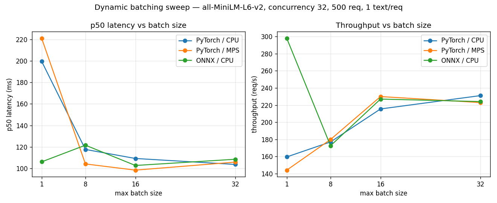

# Benchmarks

This directory documents reproducible HTTP benchmark runs for the embedding inference server. Do not publish performance claims without recording the hardware, backend, server configuration, and exact command used.

## Results

All runs below were generated in one pass by `scripts/run_matrix.py` over the matrix defined in [`ANALYSIS.md`](ANALYSIS.md), which also explains *why* the numbers look the way they do.

- **Machine:** macOS 26.5, Apple Silicon (arm64), Python 3.12.11
- **Model:** `sentence-transformers/all-MiniLM-L6-v2` (384-dim)
- **Workload:** one short sentence per request (`texts_per_request=1`), 500 measured requests, 50 warmup
- **Date:** 2026-06-04
- Single run per config (not averaged) — treat mid-sweep points as indicative, not precise.

Latencies in ms; throughput in requests/sec (sequences/sec for the no-server baselines).



### Baselines — pure model, no server (serial)

| Run | Device | p50 | p95 | p99 | Throughput |
| --- | --- | ---: | ---: | ---: | ---: |
| `naive-cpu` | CPU | 5.5 | 6.1 | 6.5 | 179.7 |
| `naive-mps` | MPS | 5.9 | 6.0 | 6.6 | 170.1 |

The floor: `model.encode` one text at a time, nothing else running.

### Serving overhead — one request through the full stack (batch 1, concurrency 1)

| Run | Device | p50 | p95 | p99 | Throughput |
| --- | --- | ---: | ---: | ---: | ---: |
| `pytorch-cpu-batch1-c1` | CPU | 6.9 | 7.2 | 7.4 | 143.3 |
| `pytorch-mps-batch1-c1` | MPS | 7.3 | 8.8 | 9.2 | 132.0 |

HTTP + FastAPI + the batcher add only **~1.4 ms/request** over the raw model floor.

### Batching sweep — concurrency 32 (the headline)

PyTorch / CPU:

| Batch | p50 | p95 | p99 | Throughput |
| ---: | ---: | ---: | ---: | ---: |
| 1 | 199.5 | 202.2 | 202.8 | 159.6 |
| 8 | 117.6 | 309.5 | 608.8 | 177.1 |
| 16 | 109.2 | 231.4 | 364.6 | 215.5 |
| 32 | 103.7 | 124.2 | 594.0 | 231.1 |

PyTorch / MPS:

| Batch | p50 | p95 | p99 | Throughput |
| ---: | ---: | ---: | ---: | ---: |
| 1 | 220.9 | 225.2 | 228.2 | 144.2 |
| 8 | 104.1 | 323.7 | 471.1 | 179.9 |
| 16 | 98.4 | 197.9 | 328.4 | 230.0 |
| 32 | 105.9 | 128.3 | 642.5 | 222.9 |

ONNX / CPU:

| Batch | p50 | p95 | p99 | Throughput |
| ---: | ---: | ---: | ---: | ---: |
| 1 | 106.1 | 108.6 | 109.1 | 297.9 |
| 8 | 121.6 | 321.3 | 593.1 | 172.6 |
| 16 | 102.7 | 175.1 | 232.2 | 227.1 |
| 32 | 108.5 | 128.6 | 588.4 | 224.1 |

### What the data shows

1. **Batching is the real win.** At a fixed concurrency of 32, moving from batch 1 → 32 roughly **halves p50 latency** (PyTorch CPU 199→104 ms, MPS 221→106 ms) and lifts throughput **~45–55%**. This is the fair comparison — same concurrency, same device, only the batcher changes — unlike comparing against the serial naive baseline, which differs on three axes at once.
2. **Serving overhead is negligible** (~1.4 ms) — the stack is not the bottleneck.
3. **MPS is not faster here.** For this tiny model and single-sentence inputs the workload is overhead-bound, so the Apple GPU matches or trails CPU at every batch size.
4. **ONNX is not faster here, on equal footing.** PyTorch-CPU vs ONNX-CPU at batch 32 is a near tie (104 vs 108 ms p50). ONNX's CPU wins typically need INT8 quantization and/or larger inputs — see the extended runs in `ANALYSIS.md`.
5. **Caveats / noise.** Each config is a single run. The `batch=8` rows and `onnx-cpu-batch1` look noisy (odd p95–p99 tails, and an anomalously high 298 rps for ONNX batch 1 — likely the executor thread pool running several single-item ONNX inferences in parallel). The high p99 (~580–640 ms) on several `batch=32` runs is the classic batching tail: the last requests in a wave plus the cold first batch. Repeat runs before quoting a precise figure.

### Reproduce

```bash
# one-time, only needed for the ONNX runs
uv run python scripts/export_onnx.py

# run the whole 16-config matrix (starts/stops a server per config)
uv run python scripts/run_matrix.py            # all 16
uv run python scripts/run_matrix.py --dry-run  # just print the plan
uv run python scripts/run_matrix.py --filter mps   # subset by name substring
```

## Start the Server

Default PyTorch/SentenceTransformers backend:

```bash
uv run uvicorn app.main:app --host 0.0.0.0 --port 8000
```

Optional ONNX backend, after exporting the model:

```bash
uv run python scripts/export_onnx.py
BACKEND=onnx uv run uvicorn app.main:app --host 0.0.0.0 --port 8000
```

## Run Benchmarks

Naive direct baseline:

```bash
uv run python scripts/naive_bench.py \
  --label naive-direct \
  --requests 500 \
  --texts-per-request 1 \
  --warmup 50 \
  --output benchmarks/naive-direct.json
```

Sequential baseline:

```bash
uv run python scripts/bench.py --requests 40 --concurrency 1
```

Concurrent benchmark:

```bash
uv run python scripts/bench.py --requests 40 --concurrency 8
```

Save JSON results:

```bash
uv run python scripts/bench.py \
  --label pytorch-batch32-c32 \
  --backend pytorch \
  --server-batch-size 32 \
  --requests 500 \
  --concurrency 32 \
  --texts-per-request 1 \
  --warmup 50 \
  --output benchmarks/pytorch-batch32-c32.json
```

## Compare Batching Modes

Run the same benchmark commands against each server configuration.

Batching disabled:

```bash
MAX_BATCH_SIZE=1 uv run uvicorn app.main:app --host 0.0.0.0 --port 8000
```

Default batching:

```bash
MAX_BATCH_SIZE=32 uv run uvicorn app.main:app --host 0.0.0.0 --port 8000
```

Use the same `--requests`, `--concurrency`, `--texts-per-request`, and `--warmup` values for both runs.

`--backend` and `--server-batch-size` document the server configuration in the JSON output. They do not change a running server. Restart the server with the matching environment variables before running the benchmark.

## Report Format

`scripts/bench.py` prints:

- successful and failed request counts
- wall time
- throughput in requests per second
- throughput in embedded sequences per second
- average latency
- p50, p95, and p99 latency

When `--output` is provided, the JSON file includes run metadata and the same summary metrics.
